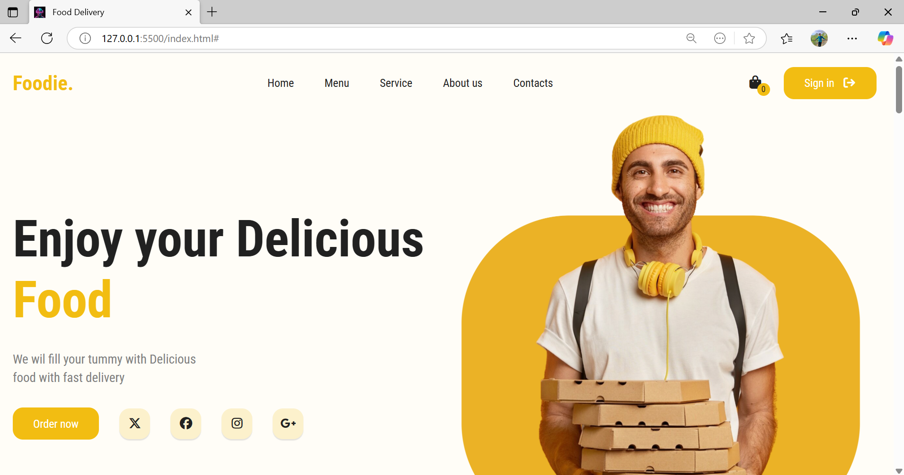
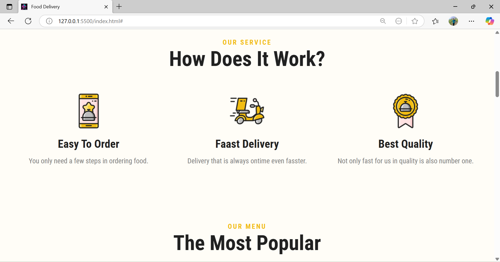
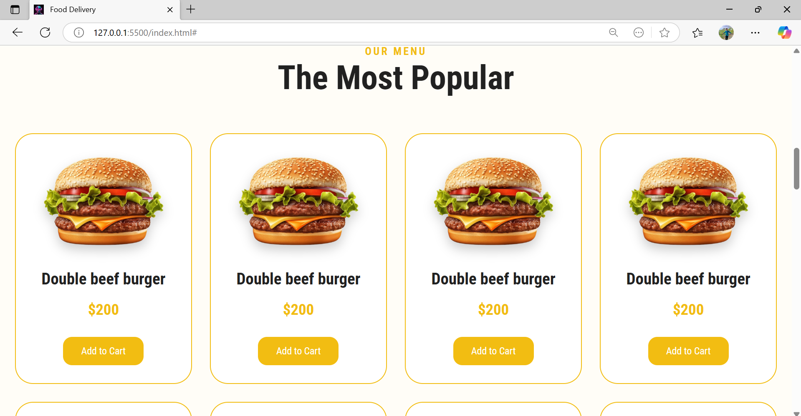
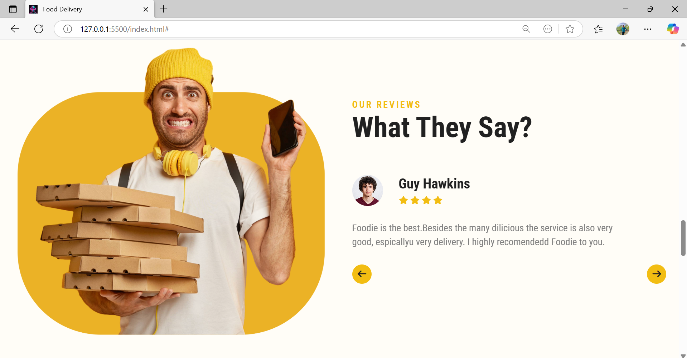

# 🍔 Foodie - Food Delivery Website

A modern and responsive **Food Delivery Website** built using **HTML, CSS, JavaScript, and JSON**.  
This project provides a simple yet attractive UI for online food ordering, complete with menu display, reviews, subscription, and cart functionality.  

---

## 🚀 Features

- 🏠 **Home Page** – Beautiful landing page with a hero section.  
- 🍽 **Menu Section** – Popular food items displayed dynamically using JSON.  
- 🛒 **Add to Cart** – Users can add items to their cart.  
- ⭐ **Customer Reviews** – Testimonial slider for customer feedback.  
- 📩 **Newsletter Subscription** – Email subscription section.  
- 🚚 **Services Section** – Easy ordering, fast delivery, and best quality.  
- 🎨 **Responsive Design** – Works smoothly across desktop and mobile devices.  

---

## 📸 Project Walkthrough with Screenshots  

### 🏠 Home Page  
The home page welcomes users with a **clean hero section** containing the project name, navigation bar, and a big promotional banner.  
It also highlights the main call-to-action: **Order Now**.  

---

### 📩 Newsletter Subscription  
This section allows users to **subscribe to the newsletter** by entering their email address.  
It encourages user engagement and builds trust by providing updates and offers.  

---

### ⭐ Customer Reviews  
The **testimonial section** displays reviews from happy customers.  
It includes customer names, star ratings, and feedback messages to improve credibility.  

---

### 🚚 How It Works  
This section explains the **services of Foodie** in three steps:  
1. **Easy to Order** – Simple and fast food ordering.  
2. **Fast Delivery** – Always on time with quick delivery.  
3. **Best Quality** – High-quality food with the best standards.  

---

### 📦 Food Menu  
The **menu section** dynamically fetches food items from a JSON file and displays them attractively.  
Each food item shows an image, name, price, and an **Add to Cart** button.  

---

## 🛠️ Tech Stack

- **Frontend:** HTML5, CSS3, JavaScript (Vanilla JS)  
- **Data Handling:** JSON  
- **Icons & UI:** FontAwesome / Custom Assets  

---

## 📂 Project Structure

Foodie/
│── index.html # Main HTML file
│── style.css # Stylesheet
│── script.js # JavaScript functionality
│── data.json # Food items data
│── images/ # Images & assets
│── README.md # Project documentation

## 💡 Future Enhancements

- 🔑 Add authentication (Sign in / Sign up with Firebase).  
- 🛒 Implement real cart with backend.  
- 📱 Create a PWA (Progressive Web App) for mobile users.  
- 💳 Integrate payment gateway.  

---

## 🤝 Contributing  

Contributions, issues, and feature requests are welcome!  
Feel free to check the [issues page](https://github.com/your-username/Foodie/issues).  

---

### 👨‍💻 Developed by Prince Kumar prem..  
